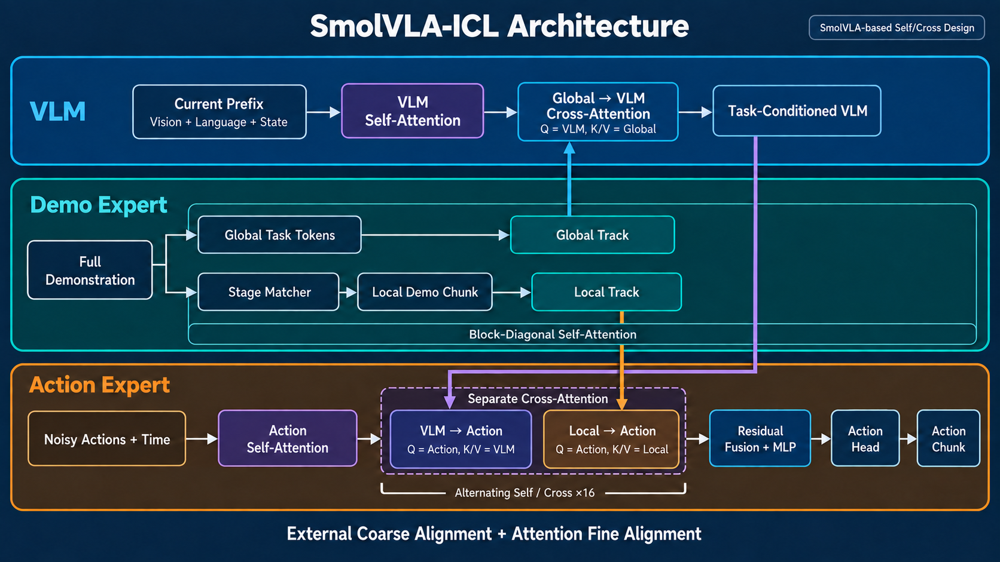

# SmolVLA 与 SmolVLA-ICL 结构笔记

## 1. SmolVLA Baseline

### 1.1 输入和输出

SmolVLA 的条件输入是当前视觉、语言指令和机器人 State：

\[
X_{\mathrm{prefix}}=
[X_{\mathrm{vision}},X_{\mathrm{language}},X_{\mathrm{state}}].
\]

动作侧输入是加入 flow-matching 噪声的 action chunk 和时间步：

\[
X_{\mathrm{suffix}}=E_a(A_t)+E_\tau(t).
\]

默认 action chunk 长度为 50，State 和 Action 最多补齐到 32 维。Action Expert 预测条件速度场：

\[
\hat u_\theta(A_t,t\mid O),
\]

并通过多步数值积分从噪声恢复动作序列。

### 1.2 VLM 与 Action Expert

- **VLM 分支**：编码 Vision、Language、State，hidden size 为 960；
- **Action Expert 分支**：由 VLM 文本模型配置缩放而来，宽度系数为 0.75，hidden size 为 720；
- 两套 hidden 在对应层共同参与注意力计算，但保留各自的归一化、MLP 和残差路径；
- 因此它不是简单的“VLM 完成后再运行 Expert”，而是层间持续交换条件信息的双分支结构。

### 1.3 Self-Attention 与 Cross-Attention

SmolVLA 在 Expert 层交替使用两类注意力：

- **Prefix 预填充 Self-Attention**：Vision、Language、State 先在 VLM 中逐层编码，并为每层生成 Prefix KV Cache；
- **联合 Self-Attention**：VLM 与 Action Expert 分别计算自己的 Q/K/V，再沿 token 维拼接后执行同一次注意力。非对称 Prefix-LM Mask 允许动作读取 Prefix 和更早的动作 token，但不允许 Prefix 反向读取 noisy actions；
- **Cross-Attention**：Action Hidden 作为 Query，VLM Prefix Hidden 作为 Key/Value，使动作反复读取视觉、语言和 State 条件。

联合 Self-Attention 可以写成：

\[
Q=[Q_P;Q_A],\qquad K=[K_P;K_A],\qquad V=[V_P;V_A],
\]

但 VLM 与 Action Expert 仍保留各自的 QKV 投影、输出投影、归一化、MLP 和残差路径。因此“联合”指共享一次注意力计算和可见关系，不等于共用同一套 Transformer 参数。

\[
\text{Self-Attention}
\Rightarrow
\text{动作内部协调和时序连续性},
\]

\[
\text{Cross-Attention}
\Rightarrow
\text{动作与场景、指令和 State 重新对齐}.
\]

### 1.4 Prefix KV Cache

在一次 action chunk 的多步 flow-matching 去噪中，Vision、Language 和 State 条件保持不变，因此可以缓存每层 Prefix 的 Key/Value：

\[
K_l^{\mathrm{prefix}},V_l^{\mathrm{prefix}}.
\]

缓存的是当前一次策略调用的条件 hidden 投影，并不是整段任务历史。下一次重新观测并生成新的 action chunk 时，Prefix 与 KV Cache 都应更新。

### 1.5 残差结构

每个分支在注意力和 MLP 后保留自己的残差流：

\[
H'_l=H_l+\operatorname{Attention}(\operatorname{Norm}(H_l)),
\]

\[
H_{l+1}=H'_l+\operatorname{MLP}(\operatorname{Norm}(H'_l)).
\]

跨分支信息通过注意力作为增量注入，而不是覆盖原 hidden。新增 Demo 条件时也应保留这种设计。

## 2. SmolVLA-ICL

### 2.1 目标与组成

SmolVLA-ICL 在保留 SmolVLA 视觉—语言—动作能力的基础上，引入 RGB 或 RGB+State Demo，以根据示范执行：

- seen tasks；
- 由已学习原语重新组合形成的 unseen tasks。

模型采用类似 W-Net 的三个 Transformer 分支：

| 分支 | 输入 token | 主要职责 |
|---|---|---|
| VLM | 当前 Vision、Language、State，记为 \(P\) | 理解当前场景和语言任务 |
| Demo Expert | Global Task Tokens \(G\) 与 Local Demo Tokens \(L\) | 编码完整示范语义和当前阶段参考 |
| Action Expert | noisy action chunk 与 flow time，记为 \(A_t\) | 预测 flow-matching 速度场 |

代码层面的主干明确为：

\[
[\mathrm{VLM},\ \mathrm{Demo\ Expert},\ \mathrm{Action\ Expert}].
\]

其中 \(G\) 和 \(L\) 都属于 Demo Expert，不是第四、第五个独立分支。Demo Expert 输出仍分为 Global Hidden 与 Local Hidden：前者只直接提供给 VLM，后者只直接提供给 Action Expert。VLM 与 Demo Expert 从两侧共同条件化 Action Expert，因此形成 W-like 信息流。

~~~text
Full Demo ─> Global Tokens ─┐                       ┌─> VLM
                            ├─> Demo Expert ────────┤
Aligned Local Chunk ────────┘                       └─> Action Expert
                                                         ▲
Current V/L/S ───────────────────────> VLM ───────────────┘
~~~

三个分支的参数、归一化、QKV/输出投影、MLP 和残差路径相互独立。Demo Expert 和 Action Expert 可以都由 VLM 文本 Transformer 配置缩放生成，但二者不共享权重。

### 2.2 Demo Expert 的两类输入

#### Global Task Tokens

Global 路径读取完整 Demo：

\[
D_{\mathrm{full}}
\xrightarrow{E_{\mathrm{video}}}
Z_{1:T}
\xrightarrow{\mathrm{Temporal\ Aggregator}}
G^{(0)}\in\mathbb{R}^{B\times N_G\times d_D}.
\]

视频编码器计划依次测试：

| 候选编码器 | 在本项目中的定位 |
|---|---|
| S3D | 轻量级 3D CNN 基线，先验证全局视频特征是否有效 |
| MoViNet-A0 | 更轻量、适合流式视频的候选 |
| VideoMAE-Small | 小型视频 Transformer 候选，用于测试更强时序表征 |
| Swin3D-T | 分层时空 Transformer 候选，可作为效果上界之一 |

各编码器输出都通过统一的 Temporal Aggregator 和投影层转换为固定数量、固定宽度的 Global Tokens。Global 表达任务身份、对象、目标和阶段顺序。

#### Local Demo Tokens

Local 路径读取经过阶段对齐的 Demo RGB+State Chunk：

\[
L^{(0)}
=\Pi_L\!\left(
E_{\mathrm{RGB+State}}(D_{\mathrm{local}})
+\mathrm{TimePos}
+\mathrm{TypeEmb}
\right)
\in\mathbb{R}^{B\times N_L\times d_D}.
\]

Local 表达当前阶段附近的视觉变化、机器人状态、夹爪状态、运动方向和未来参考。\(G^{(0)}\) 与 \(L^{(0)}\) 拼成 Demo Expert 的输入：

\[
H_D^{(0)}=[G^{(0)};L^{(0)}].
\]

“拼接”只用于组织 token，是否互相可见由 Demo Attention Mask 决定。

### 2.3 Demo Expert 设计

Demo Expert 使用与 Action Expert 相同类型的轻量 Transformer 配置，例如由 VLM hidden size 乘 \(0.75\) 得到 \(d_D=720\)，但使用独立参数。它在每一层保持两个 token 区域：

\[
H_D^{(l)}=[H_G^{(l)};H_L^{(l)}].
\]

每层仍采用 Pre-Norm、Attention、残差、Pre-Norm、MLP、残差：

\[
\widetilde H_D^{(l)}
=H_D^{(l)}
+\operatorname{Attn}_D^{(l)}
\left(\operatorname{Norm}(H_D^{(l)});M_D\right),
\]

\[
H_D^{(l+1)}
=\widetilde H_D^{(l)}
+\operatorname{MLP}_D^{(l)}
\left(\operatorname{Norm}(\widetilde H_D^{(l)})\right).
\]

#### 当前方案一：Global/Local 分区 Self-Attention

第一版使用 block-diagonal Mask。以下矩阵的行是 Query、列是 Key：

| Demo Query \ Demo Key | Global \(G\) | Local \(L\) |
|---|---:|---:|
| Global \(G\) | ✓ | ✗ |
| Local \(L\) | ✗ | ✓ |

即：

\[
M_D^{(1)}=
\begin{bmatrix}
1&0\\
0&1
\end{bmatrix}.
\]

Global 和 Local 使用同一个 Demo Expert 的层参数，但当前不交换信息。这既保留统一 Demo 分支，也避免任务级信息和局部运动信息过早混合。

#### 消融方案二：Global 单向影响 Local

消融实验允许 Local Query 读取 Global Key/Value，但 Global 不读取 Local：

| Demo Query \ Demo Key | Global \(G\) | Local \(L\) |
|---|---:|---:|
| Global \(G\) | ✓ | ✗ |
| Local \(L\) | ✓ | ✓ |

\[
M_D^{(2)}=
\begin{bmatrix}
1&0\\
1&1
\end{bmatrix}.
\]

该方案检验整体任务语义是否有助于消除局部动作歧义。完整双向 \(G\leftrightarrow L\) 暂不作为首版方案，因为它会使两条下游路径发生隐式信息泄漏。

Demo Hidden 会逐层保留和更新，并在对应深度被 VLM 或 Action Expert 读取，而不是中途使用一次后丢弃。

### 2.4 Union Self-Attention 与可见性

在 Union Self-Attention 层，三个分支先用自己的参数计算 Q/K/V，再沿 token 维拼接：

\[
Q^U=[Q_P^V;Q_G^D;Q_L^D;Q_A^A],
\]

\[
K^U=[K_P^V;K_G^D;K_L^D;K_A^A],\qquad
V^U=[V_P^V;V_G^D;V_L^D;V_A^A].
\]

这里的“Union”表示一次联合 Attention 计算，不表示四类 token 全部双向可见。当前方案一使用：

| Union Query \ Key | VLS Prefix \(P\) | Global \(G\) | Local \(L\) | Action \(A\) |
|---|---:|---:|---:|---:|
| VLM Prefix \(P\) | ✓ | ✗ | ✗ | ✗ |
| Demo Global \(G\) | ✗ | ✓ | ✗ | ✗ |
| Demo Local \(L\) | ✗ | ✗ | ✓ | ✗ |
| Action \(A\) | ✓ | ✗ | ✗ | causal |

含义如下：

- VLM 在 Union 层只进行原有 Prefix Self-Attention；
- Demo Expert 内的 Global/Local 当前分别 Self-Attend；
- Action 延续 SmolVLA 的 Prefix-LM 关系：读取当前 VLS Prefix，并与更早的 Action token 交换信息；
- \(P\)、\(G\)、\(L\) 都不能读取 noisy action；
- Action 在 Union 层不直接读取 \(G\) 或 \(L\)，Demo 条件只通过专用 Cross-Attention 注入。

VLS Prefix 内部仍保留 SmolVLA 的细粒度 Mask，例如 Vision/Language 为同一块，State 可以读取前面的 Vision/Language。

消融方案二只改变一个 block：允许 Local Query 读取 Global Key/Value，即上表的 \(L\leftarrow G\) 从 ✗ 改为 ✓，其余 Union 可见关系保持不变。

### 2.5 Cross-Attention 与可见性

当前模型只开放三条有方向的 Cross-Attention 边：

| Cross-Attention | Query | Key/Value | 作用 |
|---|---|---|---|
| Global \(\rightarrow\) VLM | \(H_P\) | \(H_G\) | 把完整 Demo 的任务语义写入当前场景表示 |
| VLM \(\rightarrow\) Action | \(H_A\) | \(H_P'\) | 让动作与当前视觉、语言和 State 对齐 |
| Local \(\rightarrow\) Action | \(H_A'\) | \(H_L\) | 提供当前阶段的局部动作参考 |

\[
H_P'
=H_P+\alpha_G\operatorname{CrossAttn}_{P\leftarrow G}
(Q=H_P,K/V=H_G),
\]

\[
H_A'
=H_A+\alpha_P\operatorname{CrossAttn}_{A\leftarrow P}
(Q=H_A,K/V=H_P'),
\]

\[
H_A''
=H_A'+\alpha_L\operatorname{CrossAttn}_{A\leftarrow L}
(Q=H_A',K/V=H_L).
\]

\(\alpha_G,\alpha_P,\alpha_L\) 是独立残差门控。原 SmolVLA 已有的 \(A\leftarrow P\) 路径保持 \(\alpha_P=1\) 并加载预训练参数；新增的 \(\alpha_G,\alpha_L\) 可用较小值初始化后学习，减少对预训练主干的扰动。三条边使用独立的 Norm、Q/K/V 投影和输出投影，以处理 VLM 与两个 Expert 之间不同的 hidden size。

明确禁止的直接路径包括：

- Action \(\leftarrow\) Global：Global 必须先经过 VLM；
- VLM \(\leftarrow\) Local：局部轨迹不直接改变任务级场景理解；
- Demo Expert \(\leftarrow\) Action：避免 noisy action 污染条件分支；
- Demo Expert \(\leftarrow\) VLM：第一版保持 Demo 编码独立。

因此当前总体信息流为：

\[
G\rightarrow P\rightarrow A,\qquad L\rightarrow A,
\]

而不是把 \(G\)、\(L\)、\(P\)、\(A\) 无限制地混合。

### 2.6 Macro Block 设计

沿用 SmolVLA 默认的 16 层和 **self_attn_every_n_layers=2** 时，可组成 8 个两层 Macro Block：

#### 第 \(2k\) 层：Union Self-Attention

1. VLM、Demo Expert、Action Expert 分别计算自己的 Q/K/V；
2. 按 \([P;G;L;A]\) 拼接并应用第 2.4 节的 Mask；
3. 将输出按 token 区域切回三个分支；
4. 每个分支执行自己的输出投影、残差和 MLP。

#### 第 \(2k+1\) 层：Cross-Conditioning

1. VLM 先完成原有 Prefix 更新；
2. Demo Expert 用方案一的分区 Mask 更新 \(H_G,H_L\)；
3. VLM 读取 Global：\(P\leftarrow G\)；
4. Action 读取已经融合 Global 的 VLM：\(A\leftarrow P'\)；
5. Action 再读取 Local：\(A'\leftarrow L\)；
6. 各结果通过独立残差、Norm 和 MLP 写回原分支。

~~~text
Layer 2k:     Union Self-Attention
              P self | G self | L self | A <- P + causal A

Layer 2k+1:   G ─cross─> P ─cross─> A <─cross─ L
              Demo Expert keeps G/L hidden and updates them by residual

Repeat:       8 Macro Blocks for a 16-layer backbone
~~~

顺序上先执行 \(P\leftarrow G\)，再执行 \(A\leftarrow P'\)，保证 Global 信息在同一个 Macro Block 内即可间接到达 Action；最后的 \(A\leftarrow L\) 对动作进行阶段级修正。工程实现时，新增的 Global Cross-Attention 和 Local Cross-Attention 应作为独立子层或 adapter，不应复用同一组投影而造成语义混淆。

### 2.7 阶段对齐

完整 Demo 可能持续几十秒，而当前控制只处于其中一个阶段。Local Demo Chunk 应先由外部模块定位：

\[
\hat j_t=\operatorname{Align}(O_{1:t},D_{1:N}).
\]

首版采用 RGB+State 的在线受限 DTW，再围绕 $\hat j_t$ 提取固定长度的 Local Chunk。
`local_chunk_size` 决定总长度，`local_anchor_position_ratio` 决定锚点在
Local Chunk 中的位置。默认值为 48 和 0.4，即提取约 40% 历史与
60% 当前/未来：

\[
D_{\mathrm{local}}=D[\hat j_t-19:\hat j_t+29].
\]

外部对齐提供长视频搜索先验，Cross-Attention 在候选窗口内部执行软选择。二者分别解决全局检索和局部细粒度对应。

### 2.8 缓存与更新频率

| 信息 | 更新时机 | 一次 flow-matching 去噪内 |
|---|---|---|
| Global Task Tokens | Demo 或任务切换时 | 固定，可缓存 |
| 当前 Vision / State Prefix | 每次重新观测和规划时 | 固定，可缓存 KV |
| Local Demo Chunk | 每次 DTW 对齐或重新规划时 | 固定，可缓存 Demo Hidden/KV |
| Noisy Action | 每个去噪积分步 | 持续变化 |

因此在一次 action chunk 的多步去噪中，\(P\)、\(G\)、\(L\) 都是条件，只有 \(A_t\) 随积分更新。机械臂执行部分动作并重新观测后，再同步更新当前 Prefix 和匹配到的 Local Chunk。

训练时 Local RGB 不能缓存模型视觉 token，因为 \(E_{\mathrm{vision}}\) 需要接收
Action Loss。Local RGB 在 DataLoader 中保持 uint8，进入 Policy 后按小批次完成
归一化、SigLIP 编码和 spatial pooling；该完整单元使用 activation checkpointing，
使反向传播前只保留每帧压缩后的视觉向量。rollout 权重固定后，`set_demo`
只缓存完成 spatial pooling 的逐帧 visual hidden（默认放在 CPU），不重复保存
spatial tokens 或无效的 mean-pooled embedding。

Global Demo 注册和离线缓存也不把所有 S3D clips 一次性搬到 GPU：完整
clip tensor 保留在 CPU，按 `clip_encode_batch_size` 编码并只在 GPU 上
拼接体积较小的 clip features，再进入可训练的 State/Fusion/Temporal 路径。

### 2.9 防止忽略 Demo

仅把 Demo token 接入注意力并不能保证模型使用 Demo。应加入：

- unseen task composition，使当前 observation 或语言本身不足以决定动作；
- 相同 observation 配对不同 Demo 的反事实训练；
- Demo swap / hard negatives；
- Global task-level 对比损失；
- Local 阶段一致性或排序辅助损失；
- 独立的 Demo Cross-Attention 残差门控及门值监控。

核心检验为：

\[
\Delta_A=
\|f(O,D_{\mathrm{correct}})
-f(O,D_{\mathrm{wrong}})\|.
\]

如果替换 Demo 后动作几乎不变，说明模型学会了跳过 Demo。

## 3. 第一版实现原则

- 保持 SmolVLA 原接口和预训练权重加载逻辑；
- 明确实现 \([\mathrm{VLM},\mathrm{Demo\ Expert},\mathrm{Action\ Expert}]\) 三分支，参数、归一化、MLP 和残差路径彼此独立；
- Demo Expert 同时接收 Global 与 Local token；首版使用 block-diagonal Mask，\(G\rightarrow L\) 单向可见作为消融；
- Global Encoder、Temporal Aggregator、Stage Alignment、Demo Expert 分模块实现；
- 第一版冻结视频骨干和 VLM，训练新投影、Demo Expert 与注意力层；
- DTW 首先作为模型外的非可微模块；
- **chunk_size** 可以保持 50，但实际执行更少动作后重新观测和规划；
- 对新增 token 使用显式非对称 Mask、独立位置/时间编码和统一接口维度；
- Global Encoder 在 S3D、MoViNet-A0、VideoMAE-Small、Swin3D-T 之间做独立消融，避免与主干改动同时混淆；
- 优先复用 Prefix、Global、Local 的 KV/Hidden Cache，只对变化的 noisy actions 重算；
- 先验证 Demo 是否真正被利用，再增加更复杂的交互层。

## 4. 相关笔记

- [Global Video Embedding](./global_video_embedding.md)
- [Local Demo Chunk 与阶段对齐](./local_demo_chunking.md)
